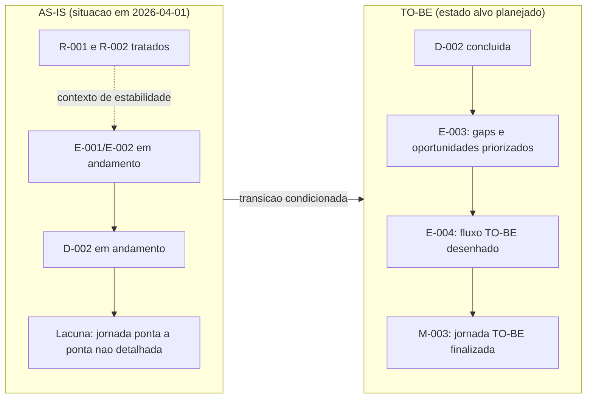

# Comparativo Visual AS-IS x TO-BE - Jornada do Cliente

## Resumo executivo
- Iniciativa: Jornada do Cliente (P-2026-001).
- O AS-IS esta em consolidacao e ainda depende da decisao D-002.
- O TO-BE ja possui sequencia planejada (E-003, E-004 e M-003), com datas-alvo definidas.
- O maior delta executivo entre os estados e a maturidade de definicao da jornada do cliente ponta a ponta.

## Metadados
- Contexto: comparativo para suporte a decisao executiva sobre transicao AS-IS para TO-BE.
- Objetivo: evidenciar diferencas de maturidade, riscos e prontidao entre estado atual e estado alvo.
- Escopo: consolidacao AS-IS, planejamento TO-BE e condicionantes de governanca.
- Responsavel(is): Leticia Fraga.
- Data de criacao: 2026-04-01.
- Data da ultima atualizacao: 2026-04-01.
- Status: ativo.
- Referencias relacionadas: 01_projetos/jornada_do_cliente/02_status_report.md, 01_projetos/jornada_do_cliente/03_riscos_impedimentos.md, 01_projetos/jornada_do_cliente/05_entregas_marcos.md.
- Proximo passo: fechar D-002 e iniciar E-003 dentro do prazo.
- Prazo: 2026-04-07.
- Riscos ou bloqueios: sistemas usados internamente; dependencia das areas internas para mapeamento.
- Decisoes pendentes: D-002 - validacao do escopo e priorizacao da fase AS-IS.

## Visual comparativo

## Quadro executivo de diferencas
| Dimensao | AS-IS (fato atual) | TO-BE (alvo planejado) | Fonte |
|---|---|---|---|
| Governanca de decisao | D-002 em andamento ate 2026-04-02 | D-002 concluida para liberar ciclo TO-BE | 02_status_report.md; 04_decisoes_atas.md |
| Maturidade da jornada | Consolidacao AS-IS em andamento (E-002) | Fluxo futuro desenhado e finalizado (E-004/M-003) | 05_entregas_marcos.md |
| Padronizacao entre areas | R-002 tratado, com causa registrada de divergencia entre areas | Gap priorizado em E-003 e incorporado no desenho TO-BE | 03_riscos_impedimentos.md; 05_entregas_marcos.md |
| Visibilidade executiva | Status verde, com dependencia de fechamento de decisao | Sequencia planejada com marcos ate 2026-04-10 | 02_status_report.md; 05_entregas_marcos.md |
| Detalhamento de experiencia do cliente | Nao explicito no dossie atual | Esperado apos E-003/E-004, sujeito a registro formal | Dossie da iniciativa (arquivos 00 a 07) |

## Leitura analitica
### Fatos
- O ciclo AS-IS nao esta encerrado no registro atual.
- O ciclo TO-BE tem datas-alvo definidas para abril de 2026.
- Nao ha risco critico aberto no fechamento mais recente.

### Hipoteses
- O principal risco de transicao e atraso na conclusao de D-002.

### Analises
- Existe base de governanca para avancar, mas ainda com lacuna de detalhamento de jornada do cliente para apresentacao executiva de experiencia.

### Recomendacoes
- Consolidar D-002 e publicar um anexo de etapas/touchpoints da jornada ao concluir E-003.

## Proximo passo operacional
| Acao | Responsavel | Prazo |
|---|---|---|
| Fechar D-002 e atualizar 04_decisoes_atas.md. | Leticia Fraga | 2026-04-02 |
| Finalizar E-003 com gaps priorizados e rastreaveis. | Leticia Fraga | 2026-04-07 |

## Historico de revisoes
| Data | Alteracao | Responsavel |
|---|---|---|
| 2026-04-01 | Criacao do comparativo visual AS-IS x TO-BE para apresentacao executiva. | Codex |
