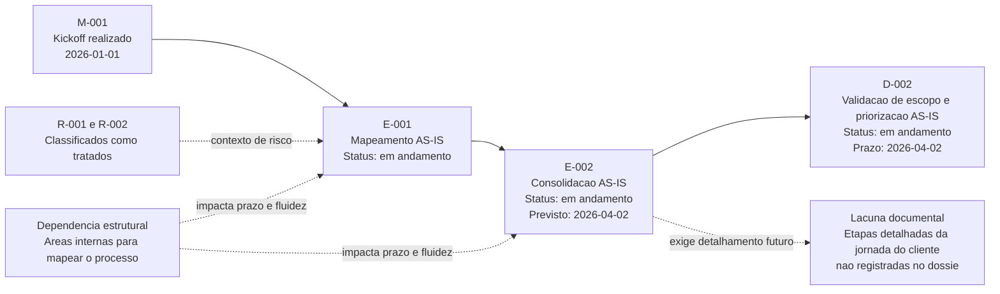

# Mapa Visual AS-IS - Jornada do Cliente

## Resumo executivo
- Iniciativa: Jornada do Cliente (P-2026-001).
- Este mapa AS-IS representa somente fatos ja registrados no dossie da iniciativa ate 2026-04-01.
- A fase AS-IS segue em andamento, com decisao D-002 ainda em conclusao.
- Lacuna critica para visao de jornada: etapas ponta a ponta do cliente ainda nao estao descritas no dossie.

## Metadados
- Contexto: consolidar uma leitura visual executiva do estado atual da iniciativa.
- Objetivo: dar visibilidade rapida do fluxo AS-IS e de seus condicionantes de governanca.
- Escopo: entregas, marcos, riscos e decisao pendente ligados a fase AS-IS.
- Responsavel(is): Leticia Fraga.
- Data de criacao: 2026-04-01.
- Data da ultima atualizacao: 2026-04-01.
- Status: ativo.
- Referencias relacionadas: 01_projetos/jornada_do_cliente/01_charter_kickoff.md, 01_projetos/jornada_do_cliente/02_status_report.md, 01_projetos/jornada_do_cliente/03_riscos_impedimentos.md, 01_projetos/jornada_do_cliente/05_entregas_marcos.md.
- Proximo passo: concluir D-002 e atualizar status de E-002.
- Prazo: 2026-04-02.
- Riscos ou bloqueios: sistemas usados internamente; dependencia das areas internas para mapeamento.
- Decisoes pendentes: D-002 - validacao do escopo e priorizacao da fase AS-IS.

## Mapa visual AS-IS (factual)

## Leitura executiva
### Fatos
- Kickoff (M-001) concluido em 2026-01-01.
- E-001 e E-002 estao em andamento no controle de entregas.
- D-002 segue em andamento com data-limite 2026-04-02.
- R-001 e R-002 estao registrados como tratados e nao ha risco critico aberto.

### Hipoteses
- A nao conclusao de D-002 no prazo pode postergar o sequenciamento da fase TO-BE.

### Analises
- Existe estrutura de governanca ativa e rastreavel, mas a fase AS-IS ainda depende de fechamento formal de decisao.
- Para uso executivo com foco em experiencia do cliente, ainda falta detalhamento de etapas/touchpoints no dossie atual.

### Recomendacoes
- Concluir D-002 e registrar deliberacao em 04_decisoes_atas.md ate 2026-04-02.
- Consolidar a visao de etapas da jornada atual junto aos donos de processo antes do inicio de E-004.

## Proximo passo operacional
| Acao | Responsavel | Prazo |
|---|---|---|
| Concluir D-002 e atualizar deliberacao formal. | Leticia Fraga | 2026-04-02 |
| Finalizar consolidacao AS-IS (E-002). | Leticia Fraga | 2026-04-02 |

## Historico de revisoes
| Data | Alteracao | Responsavel |
|---|---|---|
| 2026-04-01 | Criacao do mapa visual executivo AS-IS com base no dossie oficial da iniciativa. | Codex |
