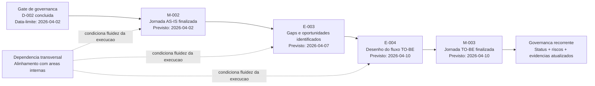

# Mapa Visual TO-BE - Jornada do Cliente

## Resumo executivo
- Iniciativa: Jornada do Cliente (P-2026-001).
- Este mapa TO-BE representa o estado futuro alvo ja previsto no dossie oficial.
- O desenho futuro depende do fechamento de D-002 e da conclusao da fase AS-IS.
- O foco executivo do TO-BE e viabilizar priorizacao de gaps e desenho de fluxo futuro com rastreabilidade.

## Metadados
- Contexto: consolidar visao visual do fluxo futuro planejado para a iniciativa.
- Objetivo: apoiar alinhamento executivo sobre sequencia de entregas da transicao AS-IS para TO-BE.
- Escopo: marco M-002, entregas E-003/E-004, marco M-003 e governanca de continuidade.
- Responsavel(is): Leticia Fraga.
- Data de criacao: 2026-04-01.
- Data da ultima atualizacao: 2026-04-01.
- Status: ativo.
- Referencias relacionadas: 01_projetos/jornada_do_cliente/01_charter_kickoff.md, 01_projetos/jornada_do_cliente/02_status_report.md, 01_projetos/jornada_do_cliente/05_entregas_marcos.md.
- Proximo passo: concluir D-002 e encadear E-003 e E-004 conforme cronograma.
- Prazo: 2026-04-10.
- Riscos ou bloqueios: sistemas usados internamente; dependencia das areas internas.
- Decisoes pendentes: D-002 - validacao do escopo e priorizacao da fase AS-IS.

## Mapa visual TO-BE (estado alvo planejado)

## Leitura executiva
### Fatos
- E-003 (gaps e oportunidades) esta planejada para 2026-04-07.
- E-004 (desenho TO-BE) esta planejada para 2026-04-10.
- M-003 (jornada TO-BE finalizada) esta prevista para 2026-04-10.
- O status report indica dependencia da conclusao de D-002 para avancar com previsibilidade.

### Hipoteses
- Com D-002 concluida no prazo, a transicao de AS-IS para TO-BE tende a ocorrer sem replanejamento formal.

### Analises
- O TO-BE ja tem sequenciamento de alto nivel definido no dossie.
- A robustez do desenho futuro depende de transformar E-003 em priorizacao objetiva e rastreavel.

### Recomendacoes
- Registrar criterios de priorizacao de gaps ao concluir E-003.
- Atualizar evidencias e decisoes imediatamente apos fechamento de E-004 e M-003.

## Proximo passo operacional
| Acao | Responsavel | Prazo |
|---|---|---|
| Concluir D-002 e liberar sequencia do TO-BE. | Leticia Fraga | 2026-04-02 |
| Executar E-003 com registro de gaps e oportunidades priorizados. | Leticia Fraga | 2026-04-07 |
| Concluir E-004 e registrar M-003. | Leticia Fraga | 2026-04-10 |

## Historico de revisoes
| Data | Alteracao | Responsavel |
|---|---|---|
| 2026-04-01 | Criacao do mapa visual executivo TO-BE com base no cronograma e marcos registrados no dossie. | Codex |
